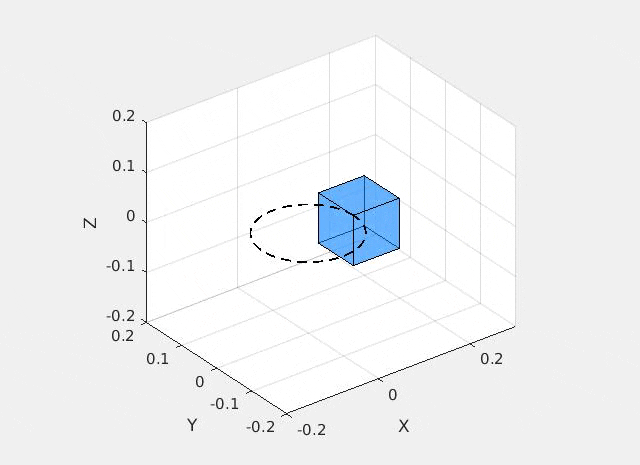

## 📄 Notes on Constrained Multibody Dynamics

[Click here to open the full PDF](constrained_multibody.pdf)

[Click here for a Matlab implementation](https://github.com/amcastro-tri/Constrained-Multibody-Matlab)

The Matlab prototype sets up a demo in which a cube has one of its corners
constrained to move along a circular path, see animation below. 

